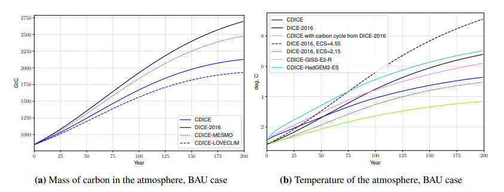

# The Climate in Climate Economics

<p align="center">

</p>

## Description of programs and datasets used

### Organization of the repository

This Python and Julia-based code repository supplements the work of [Doris Folini](https://iac.ethz.ch/people-iac/person-detail.NDY3MDg=.TGlzdC82MzcsLTE5NDE2NTk2NTg=.html), [Aleksandra Friedl](https://sites.google.com/view/aleksandrafriedl/home), [Felix Kuebler](https://sites.google.com/site/fkubler/), and [Simon Scheidegger](https://sites.google.com/site/simonscheidegger), titled _[The Climate in Climate Economics](#citation)_ (Folini et al.; 2023).

* This repository contains three distinct folders:
  1. ["calibration_data"](calibration_data): Raw data as well as the calibration scripts (written in Python 3) for *Section 3 - A comprehensive framework to calibrate the climate in IAMs*, and *Section 4 -  CDICE - re-calibrating the climate of DICE* of our article.
      - Its content and usage are detailed in the corresponding [README](calibration_data/README.md).

  2. ["DEQN_for_IAMs"](DEQN_for_IAMs): Replication codes for *Section 6 - The social cost of carbon and optimal abatement in the DICE economy*, where non-stationary integrated assessment models (IAMs) are solved by adopting ["Deep Equilibrium Nets (DEQN)"](https://onlinelibrary.wiley.com/doi/epdf/10.1111/iere.12575) to the context of climate economic models. Notice that the codes provided here complement the Online Appendix D of our article, where the formal underpinnings of the code are outlined.
      - How to compute the individual model calibrations is detailed in the various readmes that provided under the following three links: [optimal results](DEQN_for_IAMs/dice_generic/README.md), [business as usual results](DEQN_for_IAMs/dice_generic_FEX), and [results from the appendix](DEQN_for_IAMs/gdice_baseline/README.md).
      - The content and usage of the generic Deep Equilibrium Nets for Integrated Assessment Models framework are outlined in the corresponding [README](DEQN_for_IAMs/README.md).

  3. ["figures_replication"](figures_replication): Replication routines for plotting all the figures that are presented in the paper.

  
### Replication of the numerical results

* To replicate the results of the article step-by-step, a detailed set of instructions is provided _[here](#Replication)_.
  

### Datasets used

* The detailed references to the datasets used in our work are provided _[here](#Datasets)_.
    
    
## Computational requirements

### Software requirements

* We provide implementations that use python 3.10 and Julia 1.9.

* For the  The basic dependencies are [Tensorflow==2.x](https://www.tensorflow.org/), [hydra](https://hydra.cc/) and [Tensorboard](https://www.tensorflow.org/tensorboard) (for monitoring).

* The file ``requirements.txt`` lists the detailed dependencies. Please run "pip install -r requirements.txt" as the first step. See [here](https://pip.pypa.io/en/stable/user_guide/#ensuring-repeatability) for further instructions on creating and using the ``requirements.txt`` file.

* The file ``Project.toml `` lists the detailed dependencies for Julia. See [here](https://pkgdocs.julialang.org/v1/toml-files/) for detailed instructions how on how to set up and use the ``Project.toml`` file in a Julia project.


### Controlled randomness Project.toml

The random seed for our computations in *Section 6 - The social cost of carbon and optimal abatement in the DICE economy* is set at ``Climate_in_Climate_Economics/DEQN_for_IAMS/config/config.yaml``, line 10.


### Memory and runtime requirements

* To solve one IAM model as discussed in *Section 6 - The social cost of carbon and optimal abatement in the DICE economy* until full convergence, it requires about 15 min on an ordinary laptop. All those models presented in the paper were solved using our [DEQN library](DEQN_for_IAMs), which we ran on an 8-core Intel compute node on [https://nuvolos.cloud](https://nuvolos.cloud) with 64GB of RAM, and 100Gb of fast local storage (SSD).

* All the postprocessing codes (to produce the summary statistics, plots, and so forth) were run on an ordinary 4-core Intel-based laptop with Ubuntu version 18.04.5 LTS and consume typically few seconds to run.

* The approximate time needed to reproduce all the analyses for this paper on a standard (year 2023) desktop machine is 1-3 days of human time.


## Replication

* This section provides instructions on how to replicate the numerical results of the article. Note that in this readme, we only provide the basic steps to obtain the main results (e.g., for the multi-model mean of the CDICE model). Highly granular instructions on how to compute all the corner cases of the article are provided in readmes in the respective sub-folders.

* The optimal optimal order of running the computer code to replicate the results in article are as follows. 
  1. Run the instructions listed in the subsection ``1. Replication of Section 4: CDICE - re-calibrating the climate of DICE``. This set of instructions will allow you to replicate the results of section 4 of the article. 
  2. Run the instructions listed in ``2. Replication of Section 5: The social cost of carbon in partial equilibrium``. This set of instructions will allow you to replicate the results of section 5 of the article. 
  3. Run the instructions listed in ``3. Replication of Section 6: The social cost of carbon and optimal abatement in the DICE economy``. This set of instructions will allow you to replicate the results of section 6 of the article. 


### 1. Replication of Section 4: CDICE - re-calibrating the climate of DICE

In this section, we provide the basic instructions on how to compute the results presented in section 4 of the article.

First, go to the following folder:

```
$ cd <PATH to the repository>/calibration_data/Code
```

To gain further insight into the calibration of the carbon cycle, the script ``Tabel1.py`` should be used. Please run the following command:

```
$ python Tabel1.py
```

* The header of ``Tabel1.py`` allows to set the data against which the carbon cycle is to be calibrated (M2C = 'MMM', 'MESMO', or 'LOVECLIM'), whether a coarse or fine grid search is performed (COF = 'COARSE'' or 'FINE'), and over how many years the maximum norm is evaluated (default is 250 years, NMY = 250).

* The temperature response function in CDICE requires no calibration, coefficients are taken directly from [Geoffroy et al. (2013)](https://journals.ametsoc.org/view/journals/clim/26/6/jcli-d-12-00195.1.xml).

* More details are provided in [here](calibration_data/README.md).


### 2. Replication of Section 5: The social cost of carbon in partial equilibrium

In this section, we provide the basic instructions on how to compute the results presented in section 5 of the article.

First, go to the following folder:

```
$ cd <PATH to the repository>/figures_replication
```

Next, make sure you have the packages "XLSX" and "Plots" installed. You can do this by launching Julia in a terminal, and then type the following commands:

```
julia> using Pkg

julia> Pkg.add("XLSX")
julia> Pkg.add("Plots")
```

Then, run the Julia files (fig_8.jl, fig_9a.jl, fig_9b.jl, fig_10.jl), e.g., via typing the following command to your terminal:

```
julia fig_8.jl
```

* Running those four scripts will replicate all the results presented in this section. 

* More details are provided in [this readme](figures_replication/README.md).


### 3. Replication of Section 6: The social cost of carbon and optimal abatement in the DICE economy

In this section, we provide the basic instructions on how to compute the results presented in section 6 of the article.

First, make sure you are at the root directory of DEQN by changing path to the following sub-directory:

```
$ cd <PATH to the repository>/DEQN_for_IAMs
```

To start the computation from scratch, change the specifications in the config file (config/config.yaml) to the particular model of interest
while leaving the other entries untouched. The following entries will have to be adjusted:

```
defaults:
  - constants: dice_generic_XXX
  - net: dice_generic
  - optimizer: dice_generic
  - run:  dice_generic_1yts
  - variables:  dice_generic_XXX


MODEL_NAME:  dice_generic
```
XXX stands for the specific parametrisation of the model, that is presented below.

Thereafter, execute:

```
python run_deepnet.py
```

To analyze the the raw results for the particular model solved, you need to perform two steps:

```
$ export USE_CONFIG_FROM_RUN_DIR=$ cd <PATH to the repository>/Climate_in_Climate_Economics/DEQN_for_IAMS/<MODEL_FOLDER>

$ python post_process_generic.py STARTING_POINT=LATEST hydra.run.dir=$USE_CONFIG_FROM_RUN_DIR

```

The setting for solving the default multi-model mean **CDICE** model is the following: 

```
  - constants: dice_generic_mmm_mmm
  - net: dice_generic
  - optimizer: dice_generic
  - run:  dice_generic_1yts
  - variables: dice_generic_mmm_mmm
```

To analyze this model, you need to point to this folder:

```
  <MODEL_FOLDER> = dice_generic/optimal_results/cdice
```

To replicate the remaining results for individual models discussed in *Section 6 - The social cost of carbon and optimal abatement in the DICE economy*, consider the following configurations:

**dice_generic:** This is a common solution routine for the optimal solution of the climate-economy models. A readme of how to run this routine is given [here](DEQN_for_IAMs/dice_generic). The computed solutions for the models presented in the paper can be found [here](DEQN_for_IAMs/dice_generic/optimal_results).

**gdice_baseline:** This is a common solution routine for the optimal solution of the climate-economy models. A readme of how to run this routine and a list of models solved with this routine is given [here](DEQN_for_IAMs/gdice_baseline). The computed solutions can be found [here](DEQN_for_IAMs/gdice_baseline/bau_results).

**dice_generic_FEX:** This is a common solution routine for the optimal solution of the climate-economy model with alternative exogenous forcings. A readme of how to run this routine and a list of models solved with this routine is given [here](DEQN_for_IAMs/dice_generic_FEX). The computed solutions can be found [here](DEQN_for_IAMs/dice_generic_FEX/appendix_results).

* For general instructions on using our code to solve IAMs with DEQNs, please follow the instructions given [here](DEQN_for_IAMs/README.md).

* All the solution results, as well as pre-trained models for replication, are stored in the folder [optimal_results](DEQN_for_IAMs/dice_generic/optimal_results), and explained in [this readme](DEQN_for_IAMs/dice_generic/optimal_results/README.md).


## Datasets

We use various datasets as input to our computations, all of which are briefly explained below. Furthermore, we provide the relevant URLs, and include them in this repository for convenience.
Furthermore, the two relevant references to the CMIP5 datasets we are using are Meinshausen et al. (2011) and Taylor et al. (2012):
 
```
@article{taylor-et-al:12,
   author = {{Taylor}, Karl~E. and {Stouffer}, Ronald~J. and {Meehl}, Gerald~A.},
    title = "{An Overview of CMIP5 and the Experiment Design}",
  journal = {Bull. Amer. Meteor. Soc.},
     year = 2012,
   volume = 93,
    pages = {485-498},
      doi = {10.1175/BAMS-D-11-00094.1}
}

@article{meinshausen-et-al:11,
       author = {{Meinshausen}, Malte and {Smith}, S.~J. and {Calvin}, K. and {Daniel}, J.~S. and {Kainuma}, M.~L.~T. and {Lamarque}, J. -F. and {Matsumoto}, K. and {Montzka}, S.~A. and {Raper}, S.~C.~B. and {Riahi}, K. and {Thomson}, A. and {Velders}, G.~J.~M. and {van Vuuren}, D.~P.~P.},
        title = "{The RCP greenhouse gas concentrations and their extensions from 1765 to 2300}",
      journal = {Climatic Change},
         year = 2011,
        month = nov,
       volume = {109},
       number = {1-2},
        pages = {213-241},
          doi = {10.1007/s10584-011-0156-z},
       adsurl = {https://ui.adsabs.harvard.edu/abs/2011ClCh..109..213M},
      adsnote = {Provided by the SAO/NASA Astrophysics Data System}
}
``` 
 
### CMIP5 output data for Climate Emulator testing

For the two CMIP5 test cases described in Section 4.4. ('Temperature evolution as atmospheric CO2 increases at 1% per year') and Section 4.5. ('CMIP5 historical and RCP evolution as simulated by CDICE'), we use the benchmark data that was added to [this folder](calibration_data/DataFromCMIP).

The data are based on montly mean global mean surface temperature data from the CMIP5 archive, as downloaded on March 1, 2021, from http://iacweb.ethz.ch/staff/beyerleu/cmip5/. The site offers an easy to use mirror to the full CMIP5 archive at https://esgf-node.llnl.gov/search/cmip5/

The monthly mean data have been aggregated to annual means using cdo (climate data operators, https://code.mpimet.mpg.de/projects/cdo/).
The data comes in netcdf format. 
The number of CMIP5 models available varies with the concrete CMIP5 experiment:

- 27 models for RCP2.6
- 38 models for RCP4.5
- 21 models for RCP6.0
- 40 models for RCP8.5
- 31 models for 1pctCO2

Data from individual model is shown as thin gray lines in Figures 6 (1pctCO2) and 7 (CMIP5 RCPs) of the paper.


### CMIP5 input data, historical and RCPs

We used carbon emissions (GtC, fossile, other, total) and concentrations (CO2) as used in CMIP5 historical and RCP scenarios (see Taylor et al. (2012)). 

The data can be downloaded from the Potsdam Institute for Climate Impact Reasearch from following [URL](http://www.pik-potsdam.de/~mmalte/rcps/). Note that RCP3PD at PIK corresponds to RCP26. Likewise RCP6 at PIK corresponds to RCP60.

The following files contain annual carbon emissions from 1750 to 2500 for the different RCPs:

- RCP26_EMISSIONS.csv
- RCP45_EMISSIONS.csv
- RCP60_EMISSIONS.csv
- RCP85_EMISSIONS.csv

The following files contain annual mean CO2 concentrations from 1750 to 2500 for the different RCPs:

- RCP26_MIDYR_CONC.DAT
- RCP45_MIDYR_CONC.DAT
- RCP60_MIDYR_CONC.DAT
- RCP85_MIDYR_CONC.DAT

For simplicity, we added these datasets to this [folder](calibration_data/EmiAndConcData).

The said data can be read by the [Code](calibration_data/Code), by the script ClimDICE.py, via the function LoadEmiAndConcData.


## Authors

* [Doris Folini](https://iac.ethz.ch/people-iac/person-detail.NDY3MDg=.TGlzdC82MzcsLTE5NDE2NTk2NTg=.html) (ETH Zuerich, Institute for Atmospheric and Climate Science)
* [Felix Kuebler](https://sites.google.com/site/fkubler/) (the University of Zuerich, Department for Banking and Finance, and Swiss Finance Institute)
* [Aleksandra Friedl](https://sites.google.com/view/aleksandrafriedl/home) (the University of Lausanne, Department of Economics, and ifo Institute)
* [Simon Scheidegger](https://sites.google.com/site/simonscheidegger) (the University of Lausanne, Department of Economics)


## Citation

Please cite [The Climate in Climate Economics](https://papers.ssrn.com/sol3/papers.cfm?abstract_id=3885021)
in your publications if it helps your research:

```
@article{Folini_2023,
  title={The climate in climate economics},
  author={Folini, Doris and Friedl, Aleksandra and Kubler, Felix and Scheidegger, Simon},
  journal={Available at SSRN 3885021},
  year={2023}
}
```


## Support

This work was generously supported by grants from the [Swiss National Science Foundation](https://www.snf.ch) under project IDs "Can economic policy mitigate climate change," "New methods for asset pricing with frictions,” and the [Enterprise for Society (E4S)](https://e4s.center).
